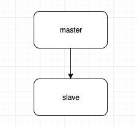
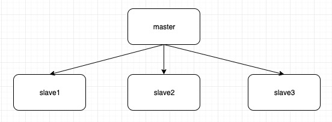
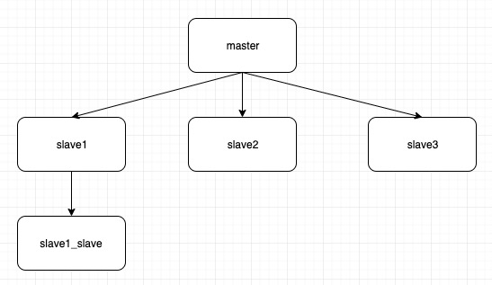
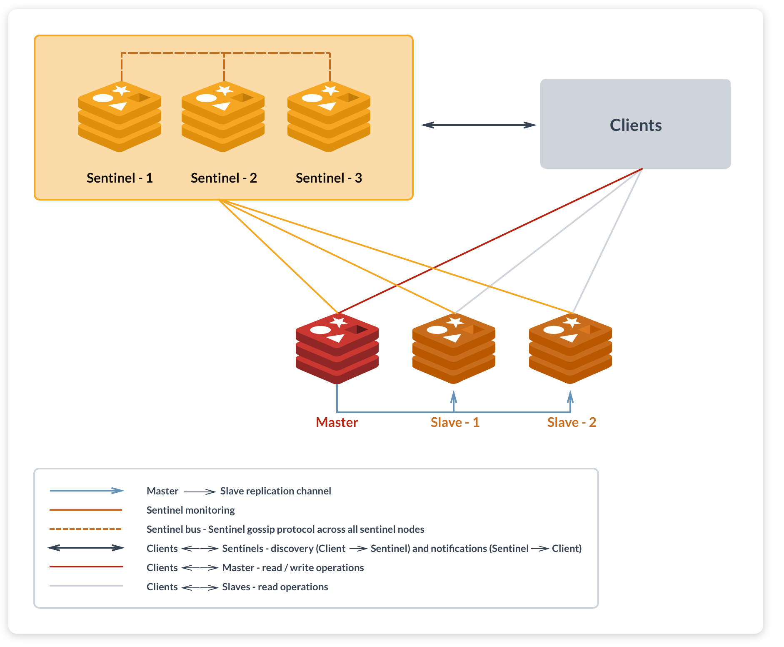
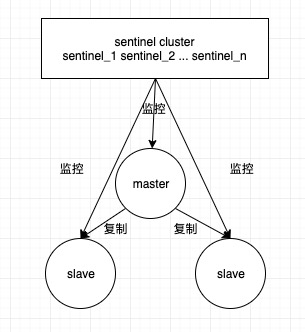
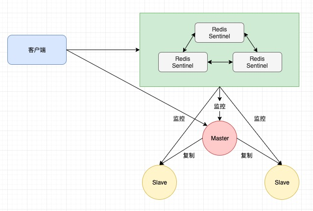
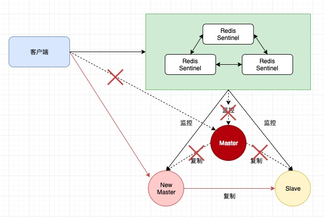
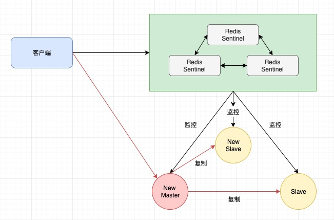

Redis集群架构演变
===

* 主从模式（Master-Slave）
* 哨兵模式（Sentinel）
* 集群模式（Cluster）

主从模式
---

主从模式也即主从复制（[Replication][1]），是指将一台Redis服务器的数据复制到其他的Redis服务器，前者成为主节点（Master或者Primary），后者称为从节点（Slave或者Replica）；每次当slave和master断开连接，slave都会自动重新连接master并且进行数据重同步。

### 主从复制的作用

1. 数据冗余：实现了数据的热备份，是持久化之外的一种数据冗余方式
2. 故障恢复：当master出现故障，可以有slave继续提供服务，实现快速的故障恢复，是一种服务冗余
3. 负载均衡：在主从复制的基础上，配合读写分离，可以由master提供写服务，由slave提供读服务（自从Redis2.6开始，slave默认开启只读模式），分担服务器负载，尤其是读多写少的场景下，可以提高服务器的并发量
4. 高可能用（High Availability）的基础：主从复制是哨兵和集群能够实施的基础

Redis并*不能保证数据的强一致性*. 这意味这在实际中集群在特定的条件下可能会丢失写操作，原因是因为Redis的复制是异步，写操作过程：

1. 客户端向主节点A写入一条命令
2. 主节点A向客户端回复命令状态
3. 主节点将写操作复制给他的从节点 A1，A2等

Redis保证*最终一致性*，即使网络断开，主从节点出现不一致，但是一旦网络恢复，从节点会采取多种策略追赶主节点，尽力保持和主节点一致。

### 拓扑结构（Replication-Topology）

1. 一主一从

数据的复制是单向的，只能由主节点到从节点

2. 一主多从（星型结构）

一个master可以拥有多个slave，但是一个slave只能拥有一个master

* 优点：通过主节点提供写服务，从节点提供读服务，对于读占比较大的场景，可以通过多个读节点分担主节点压力
* 缺点：如果写的并发量较大，多个从节点会加重主节点的同步负担

3. 从从同步（master -> slave -> slave）

slave可以接受其他slave的连接，像层叠装的结构（cascading-like structure）连接到其他slave，也即数据可以从一个从节点到另一个从节点（从从同步）

* 优点：写多的场景下，可以减轻一主多从下主节点的同步负担
* 缺点：一旦一个从节点故障，它后面的从节点也将无法完成同步

### 主从复制的部署

1. 建立复制

主从复制的开启，都是由从节点发起，不需要在主节点上做任何事情

有3种方式：

    1. 配置文件中加入`slaveof {masterip} {masterport}`
    2. redis-server启动命令后加入`--slaveof {masterip} {masterport}`
    3. 在从节点的redis-cli中执行`slaveof {masterip} {masterport}`

2. 断开复制

通过`slaveof no one`断开复制连接，需要注意的是，从节点断开复制后，不会删除已有的数据，只是不再接受主节点新的数据变化，而且从节点自身会重新变成主节点。

3. 复制的安全性

如果在主节点中通过`requirepass`设置了密码，那么需要在从节点中配置与主节点一致的密码，才能发起复制流程：

    1. 通过redis-cli输入：`config set masterauth <password>`    
    2. 通过配置文件：`masterauth <password>`

### 主从复制存在的问题

1. 主节点如果故障的话无法自动恢复
2. 写操作无法负载均衡
3. 存储能力受到单机的限制

哨兵模式
---

Redis哨兵（[Redis Sentinel][2]）在Redis2.8开始引入。核心功能是主节点的自动化故障转移。

### 哨兵的作用

1. 监控（Monitoring）：哨兵会持续监控主节点和从节点的健康状况
2. 通知（Notification）：当被监控的某个Redis服务器出现问题，哨兵可以通过API接口通知系统管理员
3. 自动故障转移（Automatic failover）：当主节点故障，哨兵会将失效的主节点的其中一个从节点升级为新的主节点，并让其他从节点改为复制新的主节点
4. 配置提供者（Configuration provider）：哨兵可以为客服端提供服务发现

### 拓扑结构（Sentinel Topology）

它由两部分组成：

* 哨兵集群：由一个或多个哨兵节点组成，哨兵节点其实是特殊的Redis节点，不存储数据；哨兵集群可以看成是一个zk集群，它是集群高可用的心脏
* 数据节点：master和slave都是数据节点

客户端连接时，会首先连接sentinel，通过sentinel获取主节点的地址，然后再连接主节点进行数据交互。当主节点故障时，客户端会重新向sentinel要地址，sentinel会将新选出来的主节点的地址告诉客户端，因此客户端无需重启就可以完成节点的切换

主节点故障前

主节点发生故障，主从复制断开连接，客户端和主节点的连接也断开；sentinel在从节点中选举出新的主节点，其他从节点和新的主节点建立主从复制关系，客户端获得新的主节点地址，重新建立连接

旧的主节点故障恢复，变成从节点，和新的主节点建立主从复制关系

### 哨兵的部署

详情移步项目内[docker-redis-sentinel][3]目录，通过docker部署的redis-sentinel集群。

### 哨兵的问题

哨兵解决了redis数据节点的自动故障迁移的问题，但是还是无法解决主从复制遗留下来的两个问题

2. 写操作无法负载均衡
3. 存储能力受到单机的限制

集群模式
---

通过集群模式（[Redis Cluster][4]），Redis解决了写操作无法负载均衡，以及存储能力受到单机限制的问题，实现了较为完善的高可用方案

Redis集群没有使用[一致性hash][5], 而是引入了*哈希槽（hash slot）*的概念.

Redis集群有16384个哈希槽，每个key通过CRC16校验后对16384取模来决定放置哪个槽。集群的每个节点负责一部分hash槽，举个例子,比如当前集群有3个节点，那么：

- 节点 A 包含 0 到 5500号哈希槽
- 节点 B 包含5501 到 11000 号哈希槽
- 节点 C 包含11001 到 16384号哈希槽

### Redis集群的主从复制

为了使在部分节点失败或者大部分节点无法通信的情况下集群仍然可用，所以集群使用了主从复制模型，每个节点都会有1到多个从节点

例如，具有A，B，C三个节点的集群，在没有主从复制的情况下，如果主节点B故障了，那么整个集群就会因为缺少5501-11000这个范围的哈希槽而不可用

如果在集群创建的时候我们为每个主节点添加一个从节点A1，B1，C1，那么整个集群便有三个主节点和三个从节点组成，这样主节点B故障后，集群便会选举B1为新的主节点继续服务，整个集群便不会因为槽缺失而不可用，不过当B和B1都故障，那么集群还是会不可用

### 拓扑架构

### 集群的部署

详情移步项目内[docker-redis-cluster][6]目录，通过docker部署的redis-cluster集群。

参考
---

* https://www.cnblogs.com/kismetv/p/9236731.html
* https://www.cnblogs.com/kismetv/p/9609938.html
* https://www.cnblogs.com/kismetv/p/9853040.html

[1]: https://redis.io/topics/replication
[2]: https://redis.io/topics/sentinel
[3]: https://github.com/yankuangshi/redis-ha/tree/master/docker-redis-sentinel
[4]: https://redis.io/topics/cluster-tutorial
[5]: http://blog.codinglabs.org/articles/consistent-hashing.html
[6]: https://github.com/yankuangshi/redis-ha/tree/master/docker-redis-cluster

