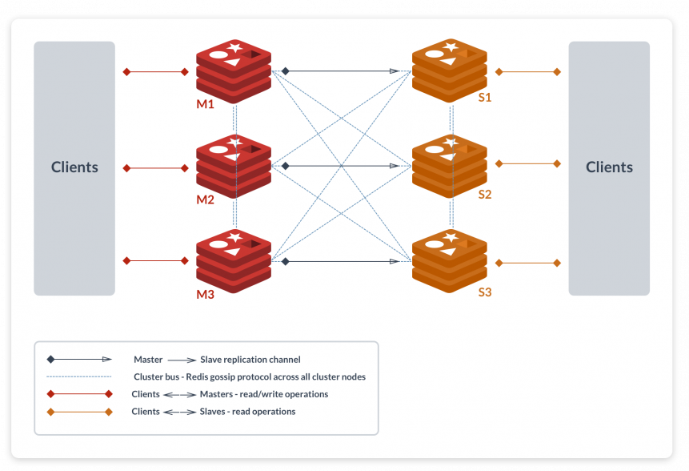
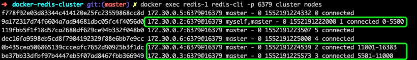
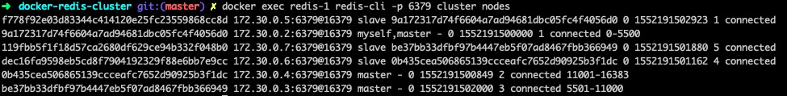

Docker-Redis-Cluster
===
该项目利用`docker`搭建一个[Redis Cluster][1]集群


(图来自：https://redislabs.com/redis-features/redis-cluster)

手动搭建Redis Cluster集群
---

1. 首先配置一个容器连接的网络

docker不再推荐使用links命令，redis cluster文档也推荐使用docker的networking模式：

> "In order to make Docker compatible with Redis Cluster you need to use the host networking mode of Docker. Please check the --net=host option in the [Docker documentation][2] for more information.”

创建容器网络：

```sh
$ docker network create red_cluster_net
```

2. 配置cluster节点的配置文件redis-cluster.conf

通过redis cluster文档可以知道，cluster节点的最少选项的集群配置文件如下：

```sh
#redis-cluster.conf
port 6379
cluster-enabled yes
cluster-config-file nodes.conf
cluster-node-timeout 5000
appendonly yes
```

* `cluster-enabled` 开启redis实例的集群模式
* `cluster-config-file` 保存节点配置文件的路径，节点配置文件无须人为修改，由集群在启动时创建，并在需要时进行自动更新

3. 启动cluster节点

```sh
$ redis-server redis.conf
```

或者也可以通过`redis-server`命令的参数启动

```sh
$ redis-server --port 6379 --cluster-enabled yes --cluster-config-file nodes.conf --cluster-node-timeout 5000 --appendonly yes
```

对应的redis容器启动：

```sh
$ docker run -d --rm \
-v $PWD/cluster-redis.conf:/usr/local/etc/redis/redis.conf \
--net red_cluster_net \
--name redis-1 \
redis redis-server /usr/local/etc/redis/redis.conf
```

或

```sh
$ docker run -d --rm \
--net red_cluster_net \
--name redis-1 \
redis redis-server --port 6379 --cluster-enabled yes --cluster-config-file nodes.conf --cluster-node-timeout 5000 --appendonly yes
```

根据redis cluster文档，最小集群要求至少3个master节点，文档强烈建议我们创建总共6个节点（3个master，3个slave）
> Note that the minimal cluster that works as expected requires to contain at least three master nodes. For your first tests it is strongly suggested to start a six nodes cluster with three masters and three slaves.

启动6个redis容器，分别命名为redis-1，redis-2，...，redis-6即可，通过以下命令可以查看每个容器的IP：

```sh
$ docker inspect -f '{{.Name}} - {{ (index .NetworkSettings.Networks "red_cluster_net").IPAddress }}' $(docker ps -q)
/redis-6 - 172.30.0.7
/redis-5 - 172.30.0.6
/redis-4 - 172.30.0.5
/redis-3 - 172.30.0.4
/redis-2 - 172.30.0.3
/redis-1 - 172.30.0.2
```

4. 关联节点

当6个cluster节点启动完成后，他们还是相互独立的节点，需要把他们关联起来

```sh
$ docker exec redis-1 redis-cli -p 6379 cluster meet 172.30.0.3 6379
OK
$ docker exec redis-1 redis-cli -p 6379 cluster meet 172.30.0.4 6379
OK
$ docker exec redis-1 redis-cli -p 6379 cluster meet 172.30.0.5 6379
OK
$ docker exec redis-1 redis-cli -p 6379 cluster meet 172.30.0.6 6379
OK
$ docker exec redis-1 redis-cli -p 6379 cluster meet 172.30.0.7 6379
Ok
```

至此为止，6个节点就相互关联起来了

5. 为主节点分配slot

redis cluster由16384个slot（槽）组成，现在需要将这16384个槽分配到其中3个主节点里

以 redis-1，redis-2，redis-3为3个主节点为例，
* 节点redis-1分配 0-5500的槽
* 节点redis-2分配 5501-11000的槽
* 节点redis-3分配 11001-16383的槽

```sh
$ docker exec redis-1 redis-cli -p 6379 cluster addslots {0..5500}
OK
$ docker exec redis-2 redis-cli -p 6379 cluster addslots {5501..11000}
OK
$ docker exec redis-3 redis-cli -p 6379 cluster addslots {11001..16383}
OK
```

通过命令验证：

```sh
$ docker exec redis-1 redis-cli -p 6379 cluster nodes
```



6. 主从复制
```sh
$ docker exec redis-4 redis-cli -p 6379 cluster replicate master_node_id
```

通过命令验证：



以上例子只是为了帮助更好地理解搭建cluster的流程：配置cluster文件 -> 启动cluster节点 -> 关联节点 -> 分配slot -> 主从复制


自动搭建Redis Cluster集群
---
redis提供了更加方便创建cluster的2种方式：

* 利用ruby脚本[redis-trib.rb][3]（该脚本位于redis的src文件夹中）创建cluster集群，该方式适合老版本redis（redis3.0和redis4.0）
* 利用`redis-cli`命令直接创建cluster集群，该方式适合redis5.0(截止目前为止redis的最新版本是5.0)

通过redis cluster文档，我们也可以发现在文档中做了相关说明：
> If you are using Redis 5, this is very easy to accomplish as we are helped by the Redis Cluster command line utility embedded into redis-cli, that can be used to create new clusters, check or reshard an existing cluster, and so forth.

> For Redis version 3 or 4, there is the older tool called redis-trib.rb which is very similar. You can find it in the src directory of the Redis source code distribution. You need to install redis gem to be able to run redis-trib.

两者的命令分别是：

redis5.0的redis-cli方式
```sh
$ redis-cli --cluster create 127.0.0.1:7000 127.0.0.1:7001 \
127.0.0.1:7002 127.0.0.1:7003 127.0.0.1:7004 127.0.0.1:7005 \
--cluster-replicas 1
```

redis3.0和redis4.0的ruby脚本方式：
```sh
$ ./redis-trib.rb create --replicas 1 127.0.0.1:7000 127.0.0.1:7001 \
127.0.0.1:7002 127.0.0.1:7003 127.0.0.1:7004 127.0.0.1:7005
```

如果我们继续用以上docker的例子来自动创建cluster集群，命令如下：

```sh
$ docker run -i --rm -v $PWD/redis-trib.rb:/redis-trib.rb --net red_cluster_net ruby sh -c '\
    gem install redis \
    && ruby redis-trib.rb create --replicas 1 172.30.0.2:6379 172.30.0.3:6379 172.30.0.4:6379 172.30.0.5:6379 172.30.0.6:6379 172.30.0.7:6379'
```

或者

```sh
$ docker run -i --rm --net red_cluster_net redis redis-cli --cluster create 172.30.0.2:6379 172.30.0.3:6379 172.30.0.4:6379 172.30.0.5:6379 172.30.0.6:6379 172.30.0.7:6379 --cluster-replicas 1
```

> 这里要注意一点，无论是新创建的ruby容器还是新的redis容器都需要加入同一个docker network中（例子中为red_cluster_net），否在将无法和已经创建的6个集群节点进行通信


最后可以得到如下信息：

`[OK] All 16384 slots covered.`

表示集群中的16384个槽都有至少一个主节点在处理，集群正常运行。

实验
---
该项目目录中包含了`redis4.0-cluster-start.sh`和`redis5.0-cluster-start.sh`两份shell脚本，分别用于自动创建不同版本redis下的cluster集群

运行命令：

```sh
$ ./redis4.0-cluster-start.sh
```

或 

```sh
$ ./redis5.0-cluster-start.sh
```

Cheers!

参考
---
* https://medium.com/commencis/creating-redis-cluster-using-docker-67f65545796d
* http://thinkinjava.cn/2018/08/07/2018-08-08-Mac%20%E6%90%AD%E5%BB%BA%20Redis%20%E9%9B%86%E7%BE%A4/
* https://simplydistributed.wordpress.com/2018/08/31/redis-5-bootstrapping-a-redis-cluster-with-docker/

[1]: https://redis.io/topics/cluster-tutorial
[2]: https://docs.docker.com/network/
[3]: https://github.com/antirez/redis/blob/4.0/src/redis-trib.rb
